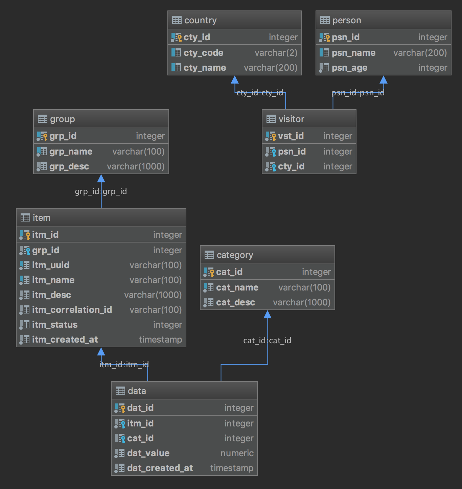

# Purple

## Features

* Spring Data REST
* HATEOAS

---

# Schema

---

# Repositories

## Group

~~~java
@RepositoryRestResource(path = "groups", collectionResourceRel = "groups")
public interface GroupRepository extends JpaRepository<GroupEntity, Long> {
    
    Optional<GroupEntity> findByName(final String name);
    
}
~~~

## Item

~~~java
@RepositoryRestResource(path = "items", collectionResourceRel = "items")
public interface ItemRepository extends JpaRepository<ItemEntity, Long> {

    Optional<ItemEntity> findByUuid(final UUID id);

    List<ItemEntity> findByCorrelationId(final UUID correlationId);

    @RestResource(path = "findByGroupName")
    List<ItemEntity> findByGroupNameContainingIgnoreCase(final String groupNameContains, final Pageable pageable);
    
}
~~~

## Category

~~~java
@RepositoryRestResource(path = "categories", collectionResourceRel = "categories", excerptProjection = CategoryNameProjection.class)
public interface CategoryRepository extends Repository<CategoryEntity, Long> {

    Optional<CategoryEntity> findById(final Long id);

    List<CategoryEntity> findAll();

    Optional<CategoryEntity> findByName(final String name);

}
~~~

## Country

~~~java
@RepositoryRestResource(path = "countries", collectionResourceRel = "countries")
public interface CountryRepository extends JpaRepository<CountryEntity, Long> {

    @RestResource(path = "findByName")
    List<CountryEntity> findByNameContainingIgnoreCase(final String nameContains);

    @RestResource(exported = false)
    Optional<CountryEntity> findByCode(final String code);

    @RestResource(exported = false)
    @Override
    void deleteById(Long id);

    @RestResource(exported = false)
    @Override
    void delete(CountryEntity countryEntity);

    @RestResource(exported = false)
    @Override
    void deleteAll(Iterable<? extends CountryEntity> var1);

}
~~~

## Person

~~~java
@RepositoryRestResource(path = "people", collectionResourceRel = "people")
public interface PersonRepository extends JpaRepository<PersonEntity, Long> {

    @RestResource(path = "findByName")
    List<PersonEntity> findByNameContainingIgnoreCase(final String nameContains);
    
}
~~~

# Resource Discoverability

    http://localhost:8061/purple/api

~~~json
{
    "_links": {
        "countries": {
            "href": "http://localhost:8061/purple/api/countries{?page,size,sort}",
            "templated": true
        },
        "groups": {
            "href": "http://localhost:8061/purple/api/groups{?page,size,sort}",
            "templated": true
        },
        "people": {
            "href": "http://localhost:8061/purple/api/people{?page,size,sort}",
            "templated": true
        },
        "items": {
            "href": "http://localhost:8061/purple/api/items{?page,size,sort,projection}",
            "templated": true
        },
        "categories": {
            "href": "http://localhost:8061/purple/api/categories{?projection}",
            "templated": true
        },
        "profile": {
            "href": "http://localhost:8061/purple/api/profile"
        }
    }
}
~~~

# Collection Resources

    http://localhost:8061/purple/api/groups

~~~json
{
    "_embedded": {
        "groups": [
            {
                "name": "Group One",
                "description": "Group one description",
                "_links": {
                    "self": {
                        "href": "http://localhost:8061/purple/api/groups/1"
                    },
                    "groupEntity": {
                        "href": "http://localhost:8061/purple/api/groups/1"
                    },
                    "items": {
                        "href": "http://localhost:8061/purple/api/groups/1/items{?projection}",
                        "templated": true
                    }
                }
            },
            {
                "name": "Group Two",
                "description": "Group two description",
                "_links": {
                    "self": {
                        "href": "http://localhost:8061/purple/api/groups/2"
                    },
                    "groupEntity": {
                        "href": "http://localhost:8061/purple/api/groups/2"
                    },
                    "items": {
                        "href": "http://localhost:8061/purple/api/groups/2/items{?projection}",
                        "templated": true
                    }
                }
            }
        ]
    },
    "_links": {
        "self": {
            "href": "http://localhost:8061/purple/api/groups{?page,size,sort}",
            "templated": true
        },
        "profile": {
            "href": "http://localhost:8061/purple/api/profile/groups"
        },
        "search": {
            "href": "http://localhost:8061/purple/api/groups/search"
        }
    },
    "page": {
        "size": 20,
        "totalElements": 4,
        "totalPages": 1,
        "number": 0
    }
}
~~~

# Item Resources

    http://localhost:8061/purple/api/groups/3

~~~json    
{
    "name": "Group Three",
    "description": "Group three description",
    "_links": {
        "self": {
            "href": "http://localhost:8061/purple/api/groups/3"
        },
        "groupEntity": {
            "href": "http://localhost:8061/purple/api/groups/3"
        },
        "items": {
            "href": "http://localhost:8061/purple/api/groups/3/items{?projection}",
            "templated": true
        }
    }
}
~~~

# Object Graph

Note that the result above is limited to the `groups` resource only. 
However, the `items` resource includes `data` resource as well.

    http://localhost:8061/purple/api/items/7

~~~json
{
    "uuid": "fb8d5122-dfcd-4509-a99e-222e862a1658",
    "name": "Item Seven",
    "description": "Item seven description",
    "correlationId": "e4b4a967-3758-4479-9a26-7ed5608f978a",
    "status": 3,
    "createdAt": "2019-03-28T19:59:46.470675",
    "data": [
        {
            "value": 32.45,
            "createdAt": "2019-03-28T19:59:46.898805",
            "_embedded": {
                "category": {
                    "details": "Category Three - Category three description",
                    "_links": {
                        "self": {
                            "href": "http://localhost:8061/purple/api/categories/3{?projection}",
                            "templated": true
                        }
                    }
                }
            },
            "_links": {
                "category": {
                    "href": "http://localhost:8061/purple/api/categories/3{?projection}",
                    "templated": true
                },
                "item": {
                    "href": "http://localhost:8061/purple/api/items/7{?projection}",
                    "templated": true
                }
            }
        }
    ],
    "total": 32.45,
    "_links": {
        "self": {
            "href": "http://localhost:8061/purple/api/items/7"
        },
        "itemEntity": {
            "href": "http://localhost:8061/purple/api/items/7{?projection}",
            "templated": true
        },
        "group": {
            "href": "http://localhost:8061/purple/api/items/7/group"
        }
    }
}
~~~

From the Spring Data REST documentation.

> Spring Data REST tries very hard to render your object graph correctly. It tries to serialize 
unmanaged beans as normal POJOs, and it tries to create links to managed beans where necessary.

# Sub-Resources

> Spring Data REST exposes sub-resources of every item resource 
for each of the associations the item resource has.

    http://localhost:8061/purple/api/groups/2/items/4
    
~~~json
{
    "uuid": "4b30d7c8-2f17-49da-bff9-3a04364c5a08",
    "name": "Item Four",
    "description": "Item four description",
    "correlationId": "128a7512-0b92-4f49-8f61-15dabbd757b8",
    "status": 3,
    "createdAt": "2019-03-28T19:59:46.39203",
    "data": [
        {
            "value": 111.43,
            "createdAt": "2019-03-28T19:59:46.793971",
            "_embedded": {
                "category": {
                    "details": "Category Three - Category three description",
                    "_links": {
                        "self": {
                            "href": "http://localhost:8061/purple/api/categories/3{?projection}",
                            "templated": true
                        }
                    }
                }
            },
            "_links": {
                "category": {
                    "href": "http://localhost:8061/purple/api/categories/3{?projection}",
                    "templated": true
                },
                "item": {
                    "href": "http://localhost:8061/purple/api/items/4{?projection}",
                    "templated": true
                }
            }
        },
        {
            "value": 7.43,
            "createdAt": "2019-03-28T19:59:46.812306",
            "_links": {
                "item": {
                    "href": "http://localhost:8061/purple/api/items/4{?projection}",
                    "templated": true
                }
            }
        }
    ],
    "total": 118.86,
    "_links": {
        "self": {
            "href": "http://localhost:8061/purple/api/items/4"
        },
        "itemEntity": {
            "href": "http://localhost:8061/purple/api/items/4{?projection}",
            "templated": true
        },
        "group": {
            "href": "http://localhost:8061/purple/api/items/4/group"
        }
    }
}
~~~
    
# Projections

Projections alter the view of the returned data.

### Subset

This projection returns the item name and description

~~~java
@Projection(name = "name", types = { Item.class })
public interface ItemNameProjection {
    String getName();
    String getDescription();
}
~~~

    http://localhost:8061/purple/api/items/1?projection=name
    
returns a subset of the `item` resource

~~~json
{
    "name": "Item One",
    "description": "Item one description",
    "_links": {
        "self": {
            "href": "http://localhost:8061/purple/api/items/1"
        },
        "itemEntity": {
            "href": "http://localhost:8061/purple/api/items/1{?projection}",
            "templated": true
        },
        "group": {
            "href": "http://localhost:8061/purple/api/items/1/group"
        }
    }
}
~~~

### Using SpEL

~~~java
@Projection(name = "name", types = { CategoryEntity.class })
public interface CategoryNameProjection {

    @Value("#{target.name} - #{target.description}")
    String getDetails();
}
~~~

    http://localhost:8061/purple/api/categories/1?projection=name
    
~~~json
{
    "details": "Category One - Category one description",
    "_links": {
        "self": {
            "href": "http://localhost:8061/purple/api/categories/1"
        },
        "categoryEntity": {
            "href": "http://localhost:8061/purple/api/categories/1{?projection}",
            "templated": true
        }
    }
}
~~~

### Superset

~~~java
@Projection(name = "full", types = { ItemEntity.class })
public interface ItemFullProjection {
    String getId();
    UUID getUuid();
    String getName();
    String getDescription();
    String getCorrelationId();
    Integer getStatus();
    LocalDateTime getCreatedAt();
    List<DataFullProjection> getData();
}
~~~

and

~~~java
@Projection(name = "full", types = { DataEntity.class })
public interface DataFullProjection {
    String getId();
    BigDecimal getValue();
    LocalDateTime getCreatedAt();
    CategoryNameProjection getCategory();
}
~~~

    http://localhost:8061/purple/api/items/4?projection=full

~~~json
{
    "name": "Item Four",
    "id": "4",
    "data": [
        {
            "value": 111.43,
            "id": "15",
            "createdAt": "2019-03-28T19:59:46.793971",
            "category": {
                "details": "Category Three - Category three description",
                "_links": {
                    "self": {
                        "href": "http://localhost:8061/purple/api/categories/3{?projection}",
                        "templated": true
                    }
                }
            }
        },
        {
            "value": 7.43,
            "id": "16",
            "createdAt": "2019-03-28T19:59:46.812306",
            "category": null
        }
    ],
    "description": "Item four description",
    "uuid": "4b30d7c8-2f17-49da-bff9-3a04364c5a08",
    "correlationId": "128a7512-0b92-4f49-8f61-15dabbd757b8",
    "status": 3,
    "createdAt": "2019-03-28T19:59:46.39203",
    "_links": {
        "self": {
            "href": "http://localhost:8061/purple/api/items/4"
        },
        "itemEntity": {
            "href": "http://localhost:8061/purple/api/items/4{?projection}",
            "templated": true
        },
        "group": {
            "href": "http://localhost:8061/purple/api/items/4/group"
        }
    }
}
~~~

Note that the `CategoryNameProjection` is used to include category details. Category is usually
excluded because it is a managed resource.

Also, `id` fields are omitted by default. However, we have chosen to include them here by
explicitly specifying them in the projection. 

# Excerpts

An excerpt is a projection that is automatically applied to a resource collection.

~~~java
@Projection(name = "name", types = { CategoryEntity.class })
public interface CategoryNameProjection {

    @Value("#{target.name} - #{target.description}")
    String getDetails();
}
~~~

~~~java
@RepositoryRestResource(path = "categories", collectionResourceRel = "categories", excerptProjection = CategoryNameProjection.class)
public interface CategoryRepository extends Repository<CategoryEntity, Long> {

    Optional<CategoryEntity> findById(final Long id);

    List<CategoryEntity> findAll();

    Optional<CategoryEntity> findByName(final String name);

}
~~~

    http://localhost:8061/purple/api/categories
    
Projection is automatically applied

~~~json
{
    "_embedded": {
        "categories": [
            {
                "details": "Category One - Category one description",
                "_links": {
                    "self": {
                        "href": "http://localhost:8061/purple/api/categories/1"
                    },
                    "categoryEntity": {
                        "href": "http://localhost:8061/purple/api/categories/1{?projection}",
                        "templated": true
                    }
                }
            },
            {
                "details": "Category Three - Category three description",
                "_links": {
                    "self": {
                        "href": "http://localhost:8061/purple/api/categories/3"
                    },
                    "categoryEntity": {
                        "href": "http://localhost:8061/purple/api/categories/3{?projection}",
                        "templated": true
                    }
                }
            }
        ]
    },
    "_links": {
        "self": {
            "href": "http://localhost:8061/purple/api/categories"
        },
        "profile": {
            "href": "http://localhost:8061/purple/api/profile/categories"
        },
        "search": {
            "href": "http://localhost:8061/purple/api/categories/search"
        }
    }
}
~~~

# Search

The `ItemRepository` looks like this.

~~~java
@RepositoryRestResource(path = "items", collectionResourceRel = "items")
public interface ItemRepository extends JpaRepository<ItemEntity, Long> {

    Optional<ItemEntity> findByUuid(final UUID id);

    List<ItemEntity> findByCorrelationId(final UUID correlationId);

    @RestResource(path = "findByGroupName")
    List<ItemEntity> findByGroupNameContainingIgnoreCase(final String groupNameContains, final Pageable pageable);

}
~~~

When we use the `/search` path

    http://localhost:8061/purple/api/items/search
    
we get a list of the query methods on the resource repository.

~~~json
{
    "_links": {
        "findByUuid": {
            "href": "http://localhost:8061/purple/api/items/search/findByUuid{?id,projection}",
            "templated": true
        },
        "findByCorrelationId": {
            "href": "http://localhost:8061/purple/api/items/search/findByCorrelationId{?correlationId,projection}",
            "templated": true
        },
        "findByGroupNameContainingIgnoreCase": {
            "href": "http://localhost:8061/purple/api/items/search/findByGroupName{?groupNameContains,page,size,sort,projection}",
            "templated": true
        },
        "self": {
            "href": "http://localhost:8061/purple/api/items/search"
        }
    }
}
~~~

    http://localhost:8061/purple/api/items/search/findByGroupName?groupNameContains=three
    
~~~json
{
    "_embedded": {
        "items": [
            {
                "uuid": "fb8d5122-dfcd-4509-a99e-222e862a1658",
                "name": "Item Seven",
                "description": "Item seven description",
                "correlationId": "e4b4a967-3758-4479-9a26-7ed5608f978a",
                "status": 3,
                "createdAt": "2019-03-28T19:59:46.470675",
                "data": [
                    {
                        "value": 32.45,
                        "createdAt": "2019-03-28T19:59:46.898805",
                        "_embedded": {
                            "category": {
                                "details": "Category Three - Category three description",
                                "_links": {
                                    "self": {
                                        "href": "http://localhost:8061/purple/api/categories/3{?projection}",
                                        "templated": true
                                    }
                                }
                            }
                        },
                        "_links": {
                            "category": {
                                "href": "http://localhost:8061/purple/api/categories/3{?projection}",
                                "templated": true
                            },
                            "item": {
                                "href": "http://localhost:8061/purple/api/items/7{?projection}",
                                "templated": true
                            }
                        }
                    }
                ],
                "total": 32.45,
                "_links": {
                    "self": {
                        "href": "http://localhost:8061/purple/api/items/7"
                    },
                    "itemEntity": {
                        "href": "http://localhost:8061/purple/api/items/7{?projection}",
                        "templated": true
                    },
                    "group": {
                        "href": "http://localhost:8061/purple/api/items/7/group"
                    }
                }
            }
        ]
    },
    "_links": {
        "self": {
            "href": "http://localhost:8061/purple/api/items/search/findByGroupName?groupNameContains=three"
        }
    }
}
~~~

# Paging and Sorting

~~~java
@RepositoryRestResource(path = "countries", collectionResourceRel = "countries")
public interface CountryRepository extends JpaRepository<CountryEntity, Long> {

    @RestResource(exported = false)
    Optional<CountryEntity> findByCode(final String code);

    @RestResource(path = "findByName")
    List<CountryEntity> findByNameContainingIgnoreCase(final String nameContains);

    @RestResource(exported = false)
    @Override
    void deleteById(Long id);

    @RestResource(exported = false)
    @Override
    void delete(CountryEntity countryEntity);

    @RestResource(exported = false)
    @Override
    void deleteAll(Iterable<? extends CountryEntity> var1);

}
~~~

    http://localhost:8061/purple/api/countries?page=5&size=3&sort=code,desc
    
~~~json
{
    "_embedded": {
        "countries": [
            {
                "code": "US",
                "name": "United States",
                "_links": {
                    "self": {
                        "href": "http://localhost:8061/purple/api/countries/233"
                    },
                    "countryEntity": {
                        "href": "http://localhost:8061/purple/api/countries/233"
                    },
                    "people": {
                        "href": "http://localhost:8061/purple/api/countries/233/people"
                    }
                }
            },
            {
                "code": "UM",
                "name": "United States Minor Outlying Islands",
                "_links": {
                    "self": {
                        "href": "http://localhost:8061/purple/api/countries/234"
                    },
                    "countryEntity": {
                        "href": "http://localhost:8061/purple/api/countries/234"
                    },
                    "people": {
                        "href": "http://localhost:8061/purple/api/countries/234/people"
                    }
                }
            },
            {
                "code": "UG",
                "name": "Uganda",
                "_links": {
                    "self": {
                        "href": "http://localhost:8061/purple/api/countries/229"
                    },
                    "countryEntity": {
                        "href": "http://localhost:8061/purple/api/countries/229"
                    },
                    "people": {
                        "href": "http://localhost:8061/purple/api/countries/229/people"
                    }
                }
            }
        ]
    },
    "_links": {
        "first": {
            "href": "http://localhost:8061/purple/api/countries?page=0&size=3&sort=code,desc"
        },
        "prev": {
            "href": "http://localhost:8061/purple/api/countries?page=4&size=3&sort=code,desc"
        },
        "self": {
            "href": "http://localhost:8061/purple/api/countries"
        },
        "next": {
            "href": "http://localhost:8061/purple/api/countries?page=6&size=3&sort=code,desc"
        },
        "last": {
            "href": "http://localhost:8061/purple/api/countries?page=81&size=3&sort=code,desc"
        },
        "profile": {
            "href": "http://localhost:8061/purple/api/profile/countries"
        },
        "search": {
            "href": "http://localhost:8061/purple/api/countries/search"
        }
    },
    "page": {
        "size": 3,
        "totalElements": 245,
        "totalPages": 82,
        "number": 5
    }
}
~~~

Note the next and previous page links.

Paging can be included on some query methods and not others.

~~~java
@RepositoryRestResource(path = "items", collectionResourceRel = "items")
public interface ItemRepository extends JpaRepository<ItemEntity, Long> {

    Optional<ItemEntity> findByUuid(final UUID id);

    List<ItemEntity> findByCorrelationId(final UUID correlationId);

    @RestResource(path = "findByGroupName")
    List<ItemEntity> findByGroupNameContainingIgnoreCase(final String groupNameContains, final Pageable pageable);

}
~~~

And putting it all together

    http://localhost:8061/purple/api/items/search/findByGroupName?groupNameContains=gro&page=1&size=3&sort=name,desc&projection=totals

~~~json
{
    "_embedded": {
        "items": [
            {
                "name": "Item Seven",
                "description": "Item seven description",
                "total": 32.45,
                "_links": {
                    "self": {
                        "href": "http://localhost:8061/purple/api/items/7"
                    },
                    "itemEntity": {
                        "href": "http://localhost:8061/purple/api/items/7{?projection}",
                        "templated": true
                    },
                    "group": {
                        "href": "http://localhost:8061/purple/api/items/7/group"
                    }
                }
            },
            {
                "name": "Item One",
                "description": "Item one description",
                "total": 319.99,
                "_links": {
                    "self": {
                        "href": "http://localhost:8061/purple/api/items/1"
                    },
                    "itemEntity": {
                        "href": "http://localhost:8061/purple/api/items/1{?projection}",
                        "templated": true
                    },
                    "group": {
                        "href": "http://localhost:8061/purple/api/items/1/group"
                    }
                }
            },
            {
                "name": "Item Four",
                "description": "Item four description",
                "total": 118.86,
                "_links": {
                    "self": {
                        "href": "http://localhost:8061/purple/api/items/4"
                    },
                    "itemEntity": {
                        "href": "http://localhost:8061/purple/api/items/4{?projection}",
                        "templated": true
                    },
                    "group": {
                        "href": "http://localhost:8061/purple/api/items/4/group"
                    }
                }
            }
        ]
    },
    "_links": {
        "self": {
            "href": "http://localhost:8061/purple/api/items/search/findByGroupName?groupNameContains=gro&page=1&size=3&sort=name,desc&projection=totals"
        }
    }
}
~~~

# Create (POST)

    URL: http://localhost:8061/purple/api/groups
    Method: POST
    Content-Type: application/json
    Body:
    {
        "name": "Group Six",
        "description": "Group six description"
    }

or

    URL: http://localhost:8061/purple/items
    Method: POST
    Content-Type:application/json
    body: 
    {
        "group": "http://localhost:8061/purple/api/groups/4",
        "uuid": "9f84fa9a-4b9c-46f8-9098-4603efe7ccbc",
        "name": "Item Nine",
        "description": "Item nine description",
        "correlationId": "128a7512-0b92-4f49-8f61-15dabbd757b8",
        "status": 3,
        "data": [
            {
                "value": 11.49
            },
            {
                "category": "http://localhost:8061/purple/categories/1",
                "value": 45.76
            }
        ]
    }
    
Note the resource URL in the JSON to specify the `group` and `category` parent entities.

# Update (PUT)

PUT replaces the entire resource so all values must be specified.

    URL: http://localhost:8061/purple/api/groups/4
    Method: PUT
    Content-Type: application/json
    body: 
    {
        "name": "Group Four updated",
        "description": "New group four description"
    }
    
or
    
    URL: http://localhost:8061/purple/api/items/4
    Method: PUT
    Content-Type:application/json
    body: 
    {
        "group": "http://localhost:8061/purple/groups/4",
        "uuid": "8574a479-b583-4db4-9c03-bfd0ddc7a069",
        "name": "Item four name",
        "description": "New Item four description",
        "correlationId": "128a7512-0b92-4f49-8f61-15dabbd757b8",
        "status": 3,
        "data": [
            {
                "category": "http://localhost:8061/purple/categories/3",
                "value": 11.49
            },
            {
                "value": 45.76
            }
        ]
    }
    
Note I couldn't alter the _number_ of items in the `data` array with this command
(ie adding or removing items). 
I suspect this is a JPA issue rather than a Spring Data REST issue. 

# Update (PATCH)

PATCH is similar to PUT but partially updates the resources state.

    URL: http://localhost:8061/purple/api/groups/4
    Method: PATCH
    Content-Type: application/json
    body: 
    {
        "description": "Group four updated again"
    }
    
or

    URL: http://localhost:8061/purple/api/items/8
    Method: PATCH
    Content-Type:application/json
    body: 
    {
        "group": "http://localhost:8061/purple/groups/3",
        "description": "Item eight description updated",
        "status": 6
    }

Note the change to the owning group.

# Delete (DELETE)

    URL: http://localhost:8061/purple/api/groups/5
    Method: DELETE

# Create Association

We have a many to many relationship between country and person.

~~~java
@Entity
@Table(name="person")
public class PersonEntity {

    @ManyToMany
    @JoinTable(
            name = "visitor",
            joinColumns = @JoinColumn(name = "psn_id"),
            inverseJoinColumns = @JoinColumn(name = "cty_id"))
    private List<CountryEntity> countries;
~~~

~~~java
@Entity
@Table(name="country")
public class CountryEntity {

    @ManyToMany(mappedBy = "countries")
    private List<PersonEntity> people;
~~~

We can link countries to people like this

    URL: http://localhost:8061/purple/people/1/countries
    Method: POST
    Content-Type: text/uri-list
    body:
    http://localhost:8061/purple/countries/20
    http://localhost:8061/purple/countries/24
    http://localhost:8061/purple/countries/30

Note this works with other association types too (eg one to one, one to many etc)

# Events

The following events are available

* `BeforeCreateEvent`
* `AfterCreateEvent`
* `BeforeSaveEvent`
* `AfterSaveEvent`
* `BeforeLinkSaveEvent`
* `AfterLinkSaveEvent`
* `BeforeDeleteEvent`
* `AfterDeleteEvent`

Events are registered as follows.

~~~java
@Component
@RepositoryEventHandler(ItemEntity.class)
public class ItemEntityEventHandler {

    @HandleBeforeCreate
    public void handleBeforeCreate(ItemEntity itemEntity) {
        System.out.println(itemEntity);
    }

    @HandleAfterCreate
    public void handleAfterCreate(ItemEntity itemEntity) {
        System.out.println(itemEntity);
    }

    @HandleBeforeSave
    public void handleBeforeSave(ItemEntity itemEntity) {
        System.out.println(itemEntity);
    }

    @HandleAfterSave
    public void handleAfterSave(ItemEntity itemEntity) {
        System.out.println(itemEntity);
    }
}
~~~

# `@RepositoryRestController`

`@RepositoryRestController` is used to override _Spring Data REST managed resources_.
In fact, it makes sure the URI refers to a repository.

~~~java
@RepositoryRestController
public class CountryController {

    private final CountryRepository countryRepository;
    private final EntityLinks entityLinks;

    @Autowired
    public CountryController(final CountryRepository countryRepository, final EntityLinks entityLinks) {
        this.countryRepository = countryRepository;
        this.entityLinks = entityLinks;
    }

    @GetMapping("countries/{code}/visitors")
    public ResponseEntity<?> visitors(@PathVariable("code") final String code)  {

        final Optional<CountryEntity> country = countryRepository.findByCode(code);
        if (country.isEmpty()) {
            return ResponseEntity.notFound().build();
        }

        final List<Resource> visitors = country.get()
                .getPeople()
                .stream()
                .map(Resource::new)
                .collect(Collectors.toList());

        final Resources<Resource> resources = new Resources<>(visitors);
        resources.add(linkTo(methodOn(CountryController.class).visitors(null)).withSelfRel());
        resources.add(entityLinks.linkToSingleResource(CountryEntity.class, country.get().getId()).withRel("country"));
        return ResponseEntity.ok(resources);
    }
}
~~~

    http://localhost:8061/purple/api/countries/BB/visitors
    
~~~json
{
    "_embedded": {
        "people": [
            {
                "name": "Bob Jones",
                "age": 31
            }
        ]
    },
    "_links": {
        "self": {
            "href": "http://localhost:8061/purplecountries/{code}/visitors",
            "templated": true
        },
        "country": {
            "href": "http://localhost:8061/purple/api/countries/20"
        }
    }
}
~~~

# `@BasePathAwareController`

To build custom operations underneath `basePath`, such as Spring MVC views, resources, and others, use `@BasePathAwareController`.

~~~java
@BasePathAwareController
public class StatisticsController {

    private final CountryRepository countryRepository;
    private final PersonRepository personRepository;
    private final EntityLinks entityLinks;

    @Autowired
    public StatisticsController(final CountryRepository countryRepository,
                                final PersonRepository personRepository,
                                final EntityLinks entityLinks) {
        this.countryRepository = countryRepository;
        this.personRepository = personRepository;
        this.entityLinks = entityLinks;
    }

    @GetMapping("/stats")
    public ResponseEntity<?> stats()  {

        final int countryCount = countryRepository.findAll().size();
        final int personCount = personRepository.findAll().size();

        final StatisticsResource countryStatistics = new StatisticsResource("country", countryCount);
        final StatisticsResource personStatistics = new StatisticsResource("person", personCount);

        final Resources<Resource<StatisticsResource>> resources = new Resources<>(
                List.of(
                        new Resource<>(countryStatistics),
                        new Resource<>(personStatistics)
                )
        );
        resources.add(linkTo(methodOn(StatisticsController.class).stats()).withSelfRel());
        return ResponseEntity.ok(resources);
    }
}
~~~

This introduces `StatisticsResource`. We can name the resource like this

~~~java
@Relation(value = "statistics", collectionRelation = "statistics")
public class StatisticsResource {
~~~

    http://localhost:8061/purple/api/stats

~~~json
{
    "_embedded": {
        "statistics": [
            {
                "name": "country",
                "count": 245
            },
            {
                "name": "person",
                "count": 4
            }
        ]
    },
    "_links": {
        "self": {
            "href": "http://localhost:8061/purple/stats"
        }
    }
}
~~~

# `@RestController`

Use `@Controller` or `@RestController` for code that is totally outside the scope of Spring Data REST. 
This extends to request handling, message converters, exception handling, and other uses.

~~~java
@RestController
public class VersionController {

    @GetMapping("/version")
    public ResponseEntity<?> stats()  {
        final Resource<String> version = new Resource<>("1.2.3");
        version.add(linkTo(methodOn(VersionController.class).stats()).withSelfRel());
        return ResponseEntity.ok(version);
    }
}
~~~

    http://localhost:8061/purple/version
    
Note: no `/api`

~~~json
{
    "content": "1.2.3",
    "_links": {
        "self": {
            "href": "http://localhost:8061/purple/version"
        }
    }
}
~~~

---

# HAL Browser

http://localhost:8061/purple/api
