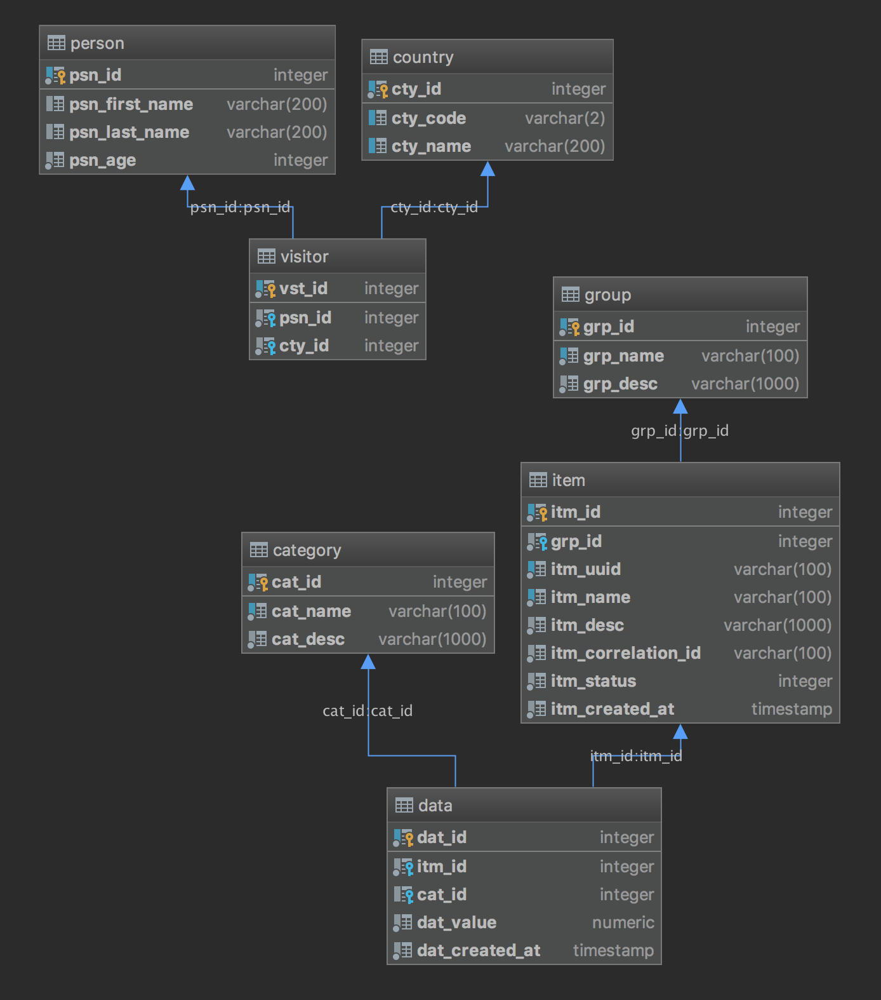

# Purple

## Features

* Spring Data REST
* HATEOAS

---

# Schema

---

# Repositories

~~~java
@RepositoryRestResource
public interface GroupRepository extends CrudRepository<Group, Long> {

    Optional<Group> findByName(final String name);

}
~~~

~~~java
@RepositoryRestResource
public interface ItemRepository extends CrudRepository<Item, Long> {

    Optional<Item> findByUuid(final UUID id);

    List<Item> findByCorrelationId(final UUID correlationId);

    @RestResource(path = "findByGroupName")
    List<Item> findByGroupNameIgnoreCase(final String groupName, final Pageable pageable);
}
~~~

~~~java
@RepositoryRestResource
public interface CategoryRepository extends CrudRepository<Category, Long> {

    Optional<Category> findByName(final String name);

}
~~~

~~~java
@RepositoryRestResource
public interface CountryRepository extends PagingAndSortingRepository<Country, Long> {

    @RestResource(path = "findByName")
    List<Country> findByNameContainingIgnoreCase(final String nameContains);
}
~~~

# Resource Discoverability

    http://localhost:8061/purple

~~~json
{
    "_links": {
        "categories": {
            "href": "http://localhost:8061/purple/categories"
        },
        "groups": {
            "href": "http://localhost:8061/purple/groups"
        },
        "items": {
            "href": "http://localhost:8061/purple/items"
        },
        "countries": {
            "href": "http://localhost:8061/purple/countries{?page,size,sort}",
            "templated": true
        },
        "profile": {
            "href": "http://localhost:8061/purple/profile"
        }
    }
}
~~~

# Collection Resources

    http://localhost:8061/purple/groups

~~~json
{
    "_embedded": {
        "groups": [
            {
                "name": "Group One",
                "description": "Group one description",
                "_links": {
                    "self": {
                        "href": "http://localhost:8061/purple/groups/1"
                    },
                    "group": {
                        "href": "http://localhost:8061/purple/groups/1"
                    },
                    "items": {
                        "href": "http://localhost:8061/purple/groups/1/items"
                    }
                }
            },
            {
                "name": "Group Two",
                "description": "Group two description",
                "_links": {
                    "self": {
                        "href": "http://localhost:8061/purple/groups/2"
                    },
                    "group": {
                        "href": "http://localhost:8061/purple/groups/2"
                    },
                    "items": {
                        "href": "http://localhost:8061/purple/groups/2/items"
                    }
                }
            }
        ]
    },
    "_links": {
        "self": {
            "href": "http://localhost:8061/purple/groups"
        },
        "profile": {
            "href": "http://localhost:8061/purple/profile/groups"
        },
        "search": {
            "href": "http://localhost:8061/purple/groups/search"
        }
    }
}
~~~

# Item Resources

    http://localhost:8061/purple/groups/3

~~~json    
{
    "name": "Group Three",
    "description": "Group three description",
    "_links": {
        "self": {
            "href": "http://localhost:8061/purple/groups/3"
        },
        "group": {
            "href": "http://localhost:8061/purple/groups/3"
        },
        "items": {
            "href": "http://localhost:8061/purple/groups/3/items"
        }
    }
}
~~~

# Object Graph

Note that the result above is limited to the `groups` resource only. 
However, the `items` resource includes `data` resource as well.

    http://localhost:8061/purple/items/3

~~~json
{
    "uuid": "85bf245e-a941-4a18-8d4b-15c3d0aebd23",
    "name": "Item Three",
    "description": "Item three description",
    "correlationId": "e4b4a967-3758-4479-9a26-7ed5608f978a",
    "status": 1,
    "createdAt": "2019-03-23T12:36:19.31113",
    "data": [
        {
            "value": 9.86,
            "createdAt": "2019-03-23T12:36:19.927159",
            "_links": {
                "item": {
                    "href": "http://localhost:8061/purple/items/3"
                },
                "category": {
                    "href": "http://localhost:8061/purple/categories/1"
                }
            }
        },
        {
            "value": 19.98,
            "createdAt": "2019-03-23T12:36:19.886639",
            "_links": {
                "item": {
                    "href": "http://localhost:8061/purple/items/3"
                },
                "category": {
                    "href": "http://localhost:8061/purple/categories/6"
                }
            }
        }
    ],
    "_links": {
        "self": {
            "href": "http://localhost:8061/purple/items/3"
        },
        "item": {
            "href": "http://localhost:8061/purple/items/3"
        },
        "group": {
            "href": "http://localhost:8061/purple/items/3/group"
        }
    }
}
~~~

From the Spring Data REST documentation.

> Spring Data REST tries very hard to render your object graph correctly. It tries to serialize 
unmanaged beans as normal POJOs, and it tries to create links to managed beans where necessary.

# Sub-Resources

> Spring Data REST exposes sub-resources of every item resource 
for each of the associations the item resource has.

    http://localhost:8061/purple/groups/2/items/4
    
~~~json
{
    "uuid": "4b30d7c8-2f17-49da-bff9-3a04364c5a08",
    "name": "Item Four",
    "description": "Item four description",
    "correlationId": "128a7512-0b92-4f49-8f61-15dabbd757b8",
    "status": 3,
    "createdAt": "2019-03-23T13:44:02.627358",
    "data": [
        {
            "value": 111.43,
            "createdAt": "2019-03-23T13:44:03.260411",
            "_links": {
                "item": {
                    "href": "http://localhost:8061/purple/items/4"
                },
                "category": {
                    "href": "http://localhost:8061/purple/categories/3"
                }
            }
        },
        {
            "value": 7.43,
            "createdAt": "2019-03-23T13:44:03.289638",
            "_links": {
                "item": {
                    "href": "http://localhost:8061/purple/items/4"
                }
            }
        }
    ],
    "_links": {
        "self": {
            "href": "http://localhost:8061/purple/items/4"
        },
        "item": {
            "href": "http://localhost:8061/purple/items/4"
        },
        "group": {
            "href": "http://localhost:8061/purple/items/4/group"
        }
    }
}
~~~

# Create (POST)

    URL: http://localhost:8061/purple/groups
    Method: POST
    Content-Type: application/json
    Body:
    {
        "name": "Group Six",
        "description": "Group six description"
    }

or

    URL: http://localhost:8061/purple/items
    Type: POST
    Content-Type:application/json
    body: 
    {
        "group": "http://localhost:8061/purple/groups/4",
        "uuid": "9f84fa9a-4b9c-46f8-9098-4603efe7ccbc",
        "name": "Item Nine",
        "description": "Item nine description",
        "correlationId": "128a7512-0b92-4f49-8f61-15dabbd757b8",
        "status": 3,
        "data": [
            {
                "value": 11.49
            },
            {
                "category": "http://localhost:8061/purple/categories/1",
                "value": 45.76
            }
        ]
    }
    
Note the resource URL in the JSON to specify the `group` and `category` parent entities.

# Update (PUT)

PUT replaces the entire resource so all values must be specified.

    URL: http://localhost:8061/purple/groups/4
    Type: PUT
    Content-Type: application/json
    body: 
    {
        "name": "Group Four updated",
        "description": "New group four description"
    }
    
or
    
    URL: http://localhost:8061/purple/items/4
    Type: PUT
    Content-Type:application/json
    body: 
    {
        "group": "http://localhost:8061/purple/groups/4",
        "uuid": "8574a479-b583-4db4-9c03-bfd0ddc7a069",
        "name": "Item four name",
        "description": "New Item four description",
        "correlationId": "128a7512-0b92-4f49-8f61-15dabbd757b8",
        "status": 3,
        "data": [
            {
                "category": "http://localhost:8061/purple/categories/3",
                "value": 11.49
            },
            {
                "value": 45.76
            }
        ]
    }
    
Note I couldn't alter the _number_ of items in the `data` array with this command
(ie adding or removing items). 
I suspect this is a JPA issue rather than a Spring Data REST issue. 

# Update (PATCH)

PATCH is similar to PUT but partially updates the resources state.

    URL: http://localhost:8061/purple/groups/4
    Type: PATCH
    Content-Type: application/json
    body: 
    {
        "description": "Group four updated again"
    }
    
or

    URL: http://localhost:8061/purple/items/8
    Type: PATCH
    Content-Type:application/json
    body: 
    {
        "group": "http://localhost:8061/purple/groups/3",
        "description": "Item eight description updated",
        "status": 6
    }

Note the change to the owning group.

# Delete (DELETE)

    URL: http://localhost:8061/purple/groups/4
    Type: DELETE
    
# Projections

Projections alter the view of the returned data.

### Subset

This projection returns the item name and description

~~~java
@Projection(name = "name", types = { Item.class })
public interface ItemNameProjection {
    String getName();
    String getDescription();
}
~~~

    http://localhost:8061/purple/items/1?projection=name
    
returns a subset of the `item` resource

~~~json
{
    "name": "Item One",
    "description": "Item one description",
    "_links": {
        "self": {
            "href": "http://localhost:8061/purple/items/1"
        },
        "item": {
            "href": "http://localhost:8061/purple/items/1{?projection}",
            "templated": true
        },
        "group": {
            "href": "http://localhost:8061/purple/items/1/group"
        }
    }
}
~~~

### Combinations

~~~java
@Projection(name = "name", types = { Category.class })
public interface CategoryNameProjection {

    @Value("#{target.name} - #{target.description}")
    String getDetails();
}
~~~

    http://localhost:8061/purple/categories/1?projection=name
    
~~~json
{
    "details": "Category One - Category one description",
    "_links": {
        "self": {
            "href": "http://localhost:8061/purple/categories/1"
        },
        "category": {
            "href": "http://localhost:8061/purple/categories/1{?projection}",
            "templated": true
        }
    }
}
~~~

### Superset

~~~java
@Projection(name = "full", types = { Item.class })
public interface ItemFullProjection {
    String getId();
    UUID getUuid();
    String getName();
    String getDescription();
    String getCorrelationId();
    Integer getStatus();
    LocalDateTime getCreatedAt();
    List<DataFullProjection> getData();
}
~~~

and

~~~java
@Projection(name = "full", types = { Data.class })
public interface DataFullProjection {
    String getId();
    BigDecimal getValue();
    LocalDateTime getCreatedAt();
    CategoryNameProjection getCategory();
}
~~~

    http://localhost:8061/purple/items/4?projection=full

~~~json
{
    "name": "Item four name",
    "id": "4",
    "status": 3,
    "data": [
        {
            "value": 11.49,
            "id": "15",
            "createdAt": "2019-03-23T13:44:03.260411",
            "category": {
                "details": "Category Three - Category three description",
                "_links": {
                    "self": {
                        "href": "http://localhost:8061/purple/categories/3{?projection}",
                        "templated": true
                    }
                }
            }
        },
        {
            "value": 45.76,
            "id": "16",
            "createdAt": "2019-03-23T13:44:03.289638",
            "category": null
        }
    ],
    "uuid": "8574a479-b583-4db4-9c03-bfd0ddc7a069",
    "correlationId": "128a7512-0b92-4f49-8f61-15dabbd757b8",
    "createdAt": "2019-03-23T13:44:02.627358",
    "description": "New Item four description",
    "_links": {
        "self": {
            "href": "http://localhost:8061/purple/items/4"
        },
        "item": {
            "href": "http://localhost:8061/purple/items/4{?projection}",
            "templated": true
        },
        "group": {
            "href": "http://localhost:8061/purple/items/4/group"
        }
    }
}
~~~

Note that the category projection is used to include categories which would normally be excluded
because they are a managed resource.

Also, `id` fields are omitted by default. However, we have chosen to include them here by
explicitly specifying them in the projection. 

# Search

The `ItemRepository` looks like this.

~~~java
@RepositoryRestResource
public interface ItemRepository extends CrudRepository<Item, Long> {

    Optional<Item> findByUuid(final UUID id);

    List<Item> findByCorrelationId(final UUID correlationId);

    @RestResource(path = "findByGroupName")
    List<Item> findByGroupNameIgnoreCase(final String groupName, final Pageable pageable);
}
~~~

When we use the `/search` path

    http://localhost:8061/purple/items/search
    
we get a list of the query methods on the resource repository.

~~~json
{
    "_links": {
        "findByGroupNameIgnoreCase": {
            "href": "http://localhost:8061/purple/items/search/findByGroupName{?groupName,page,size,sort,projection}",
            "templated": true
        },
        "findByCorrelationId": {
            "href": "http://localhost:8061/purple/items/search/findByCorrelationId{?correlationId,projection}",
            "templated": true
        },
        "findByUuid": {
            "href": "http://localhost:8061/purple/items/search/findByUuid{?id,projection}",
            "templated": true
        },
        "self": {
            "href": "http://localhost:8061/purple/items/search"
        }
    }
}
~~~

    http://localhost:8061/purple/items/search/findByGroupName?groupName=Group One
    
~~~json
{
    "_embedded": {
        "countries": [
            {
                "code": "AE",
                "name": "United Arab Emirates",
                "_links": {
                    "self": {
                        "href": "http://localhost:8061/purple/countries/231"
                    },
                    "country": {
                        "href": "http://localhost:8061/purple/countries/231"
                    }
                }
            },
            {
                "code": "GB",
                "name": "United Kingdom",
                "_links": {
                    "self": {
                        "href": "http://localhost:8061/purple/countries/232"
                    },
                    "country": {
                        "href": "http://localhost:8061/purple/countries/232"
                    }
                }
            },
            {
                "code": "US",
                "name": "United States",
                "_links": {
                    "self": {
                        "href": "http://localhost:8061/purple/countries/233"
                    },
                    "country": {
                        "href": "http://localhost:8061/purple/countries/233"
                    }
                }
            },
            {
                "code": "UM",
                "name": "United States Minor Outlying Islands",
                "_links": {
                    "self": {
                        "href": "http://localhost:8061/purple/countries/234"
                    },
                    "country": {
                        "href": "http://localhost:8061/purple/countries/234"
                    }
                }
            }
        ]
    },
    "_links": {
        "self": {
            "href": "http://localhost:8061/purple/countries/search/findByName?nameContains=united"
        }
    }
}
~~~

# Paging and Sorting

~~~java
@RepositoryRestResource
public interface CountryRepository extends PagingAndSortingRepository<Country, Long> {

    @RestResource(path = "findByName")
    List<Country> findByNameContainingIgnoreCase(final String nameContains);
}

~~~

    http://localhost:8061/purple/countries?page=5&size=3&sort=code,desc
    
~~~json
{
    "_embedded": {
        "countries": [
            {
                "code": "US",
                "name": "United States",
                "_links": {
                    "self": {
                        "href": "http://localhost:8061/purple/countries/233"
                    },
                    "country": {
                        "href": "http://localhost:8061/purple/countries/233"
                    }
                }
            },
            {
                "code": "UM",
                "name": "United States Minor Outlying Islands",
                "_links": {
                    "self": {
                        "href": "http://localhost:8061/purple/countries/234"
                    },
                    "country": {
                        "href": "http://localhost:8061/purple/countries/234"
                    }
                }
            },
            {
                "code": "UG",
                "name": "Uganda",
                "_links": {
                    "self": {
                        "href": "http://localhost:8061/purple/countries/229"
                    },
                    "country": {
                        "href": "http://localhost:8061/purple/countries/229"
                    }
                }
            }
        ]
    },
    "_links": {
        "first": {
            "href": "http://localhost:8061/purple/countries?page=0&size=3&sort=code,desc"
        },
        "prev": {
            "href": "http://localhost:8061/purple/countries?page=4&size=3&sort=code,desc"
        },
        "self": {
            "href": "http://localhost:8061/purple/countries"
        },
        "next": {
            "href": "http://localhost:8061/purple/countries?page=6&size=3&sort=code,desc"
        },
        "last": {
            "href": "http://localhost:8061/purple/countries?page=81&size=3&sort=code,desc"
        },
        "profile": {
            "href": "http://localhost:8061/purple/profile/countries"
        },
        "search": {
            "href": "http://localhost:8061/purple/countries/search"
        }
    },
    "page": {
        "size": 3,
        "totalElements": 245,
        "totalPages": 82,
        "number": 5
    }
}
~~~

Note the next and previous page links.

Paging can be included on some query methods and not others.

~~~java
@RepositoryRestResource(excerptProjection = ItemNameProjection.class)
public interface ItemRepository extends CrudRepository<Item, Long> {

    Optional<Item> findByUuid(final UUID id);

    List<Item> findByCorrelationId(final UUID correlationId);

    @RestResource(path = "findByGroupName")
    List<Item> findByGroupNameContainingIgnoreCase(final String groupName, final Pageable pageable);
}
~~~

And putting it all together

    http://localhost:8061/purple/items/search/findByGroupName?groupName=gro&page=1&size=3&sort=name,desc&projection=totals

~~~json
{
    "_embedded": {
        "items": [
            {
                "name": "Item Seven",
                "description": "Item seven description",
                "total": 32.45,
                "_links": {
                    "self": {
                        "href": "http://localhost:8061/purple/items/7"
                    },
                    "item": {
                        "href": "http://localhost:8061/purple/items/7{?projection}",
                        "templated": true
                    },
                    "group": {
                        "href": "http://localhost:8061/purple/items/7/group"
                    }
                }
            },
            {
                "name": "Item One",
                "description": "Item one description",
                "total": 319.99,
                "_links": {
                    "self": {
                        "href": "http://localhost:8061/purple/items/1"
                    },
                    "item": {
                        "href": "http://localhost:8061/purple/items/1{?projection}",
                        "templated": true
                    },
                    "group": {
                        "href": "http://localhost:8061/purple/items/1/group"
                    }
                }
            },
            {
                "name": "Item Nine",
                "description": "Item nine description",
                "total": 57.25,
                "_links": {
                    "self": {
                        "href": "http://localhost:8061/purple/items/10"
                    },
                    "item": {
                        "href": "http://localhost:8061/purple/items/10{?projection}",
                        "templated": true
                    },
                    "group": {
                        "href": "http://localhost:8061/purple/items/10/group"
                    }
                }
            }
        ]
    },
    "_links": {
        "self": {
            "href": "http://localhost:8061/purple/items/search/findByGroupName?groupName=gro&page=1&size=3&sort=name,desc&projection=totals"
        }
    }
}
~~~
